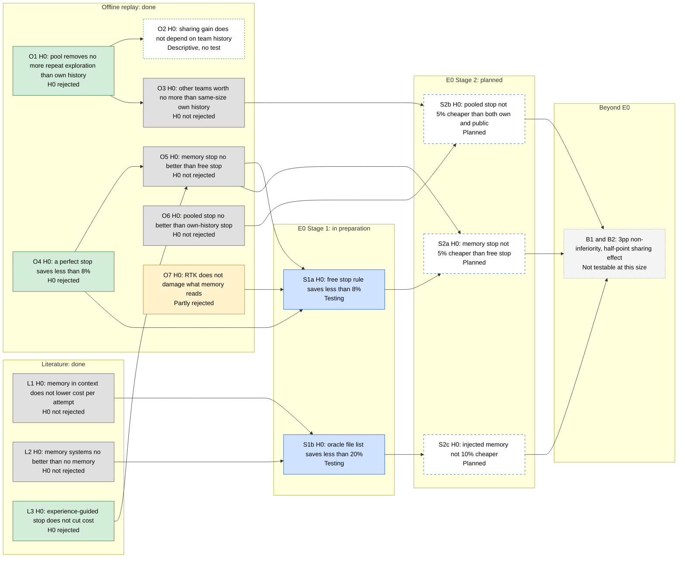

# What we test

**Question.** Does memory shared across teams make coding-agent runs cheaper at equal success, compared with each team's own history or with a free rule that uses no memory?

**Framing.** Each row states a null hypothesis (H0: "no effect", or "no effect above a set threshold") and the evidence that would reject it. B1 is the exception: it is a non-inferiority test, and its H0 is "memory lowers success by 3pp or more".

**E0** is our first live experiment: Claude Code on 123 SWE-bench Pro tasks, run in two stages (see [E0 setup](#e0-setup)). "Stage 0" means the offline checks that came before it and set its gates.

**Statuses.** *H0 rejected*: the evidence contradicts "no effect". *H0 not rejected*: no effect was found at this size, which does not prove there is none. *Partly rejected*: H0 fails for some parts of the test and holds for others. *Descriptive, no test*: the numbers are reported without a statistical test, so H0 is neither rejected nor kept. *Testing*: the experiment is being prepared or run. *Planned*: the pass rule is set and the test has not run. *Not testable at this size*: E0 is too small to answer it.

## Map

An arrow means the earlier result shaped the later test. Every node also states its status in words, so the colours are not needed to read the map.

## Summary table

"Spend" means the total token cost of all runs. Brackets are 95% confidence intervals (CI). Codes in the Evidence column, such as [R1] and [P1], point to the [Evidence](#evidence) list.

| ID | Null hypothesis (H0) | Why it matters | How it is tested (pass rule) | Status | Evidence |
|---|---|---|---|---|---|
| O1 | A pool of 3 teams' history removes no more repeated exploration than each team's own history | If teams do not repeat each other's exploration, a shared memory has nothing extra to remove | Replay of 1,179 tasks in 18 repos, with 3 simulated teams per repo. Rejected if the repo-clustered bootstrap CI of the pool − own difference excludes 0. This rule was not pre-registered | H0 rejected | Repeated exploration actions: 25.8% (own) vs 32.5% (pool). Removable tokens: 14.80% vs 18.05% of all tokens, a gain of +3.25pp. Per-repo mean gain +3.7pp [3.2, 4.2]. This is an upper limit at file-path level. At least 35.1% of the reads the pool would remove target a file that changed in between, so that content is stale [R1] |
| O2 | The sharing gain does not depend on how much history the team already has | Shows where sharing could help: new teams or new repos | Same replay, split by the number of the team's earlier tasks. Descriptive only, with no trend test | Descriptive, no test | Gain at 0–4 / 5–19 / 20+ earlier tasks: 4.5 / 3.6 / 1.4pp. Over the same buckets the own-history limit rises: 8.7 / 14.5 / 20.6%. A contiguous team split shows a sharper drop: 6.2 / 2.0 / 0.7pp [R1] |
| O3 | Other teams' history is worth no more than the same amount of the team's own history | Separates "other teams know different things" from "there is simply more history". If a size-matched pool equals own history, sharing only adds data | (a) Share of each task's gold files already touched by earlier tasks: own history vs a random pool sample of the same size. (b) Outcome-prediction AUROC with the pool vs a size-matched pool | H0 not rejected | The share of tasks where an earlier task already edited at least one gold file rises from 68.6% (own team) to 84.5% (any team) over 116 repos and 8,636 tasks. That gain is pool size: with teams assigned at random, own history gives 68.8%, the same as the round-robin teams, so "other teams" simply means 3× more history. With real PR-author teams, the size-matched pool about equals own history (gold-file share, matched vs own): on SWE-bench Pro, flipt .42 vs .42 and openlibrary .41 vs .39, and likewise in all 11 repos checked. AUROC pool − size-matched: +0.002 [−0.040, +0.034]. The AUROC curve stays flat as history grows (0.549–0.578) [R1, R2, R4] |
| O4 | A perfect stop rule would save less than 8% of spend | Upper limit on what any stop rule can save. Below 8%, the stop line is not worth testing | 67,074 OpenHands runs on 6,306 tasks. An oracle stops each resolved run just after its last edit that changes the patch. Pass: oracle saving ≥8% of all spend (Stage 0 gate) | H0 rejected | 13.9% (strict) to 17.0% (loose) of all spend. Failed runs make up 58.2% of spend. The oracle knows the outcome, so this is a ceiling, not a rule [R2] |
| O5 | A memory-guided stop rule saves no more than a free rule that uses no memory | A stop rule needs memory only if memory beats the free alternative | Same runs, with give-up rules compared at ≤1pp resolve loss. Pass: the bootstrap CI of the saving difference excludes 0. This rule was not pre-registered | H0 not rejected | Pool-memory gate 4.8% vs the free "no passing test yet" rule 3.7%. Difference +1.1pp [−0.1, +2.6]. Memory gates and the free rule save about 3.5 points of spend per point of resolve lost. History predicts outcomes only weakly: AUROC 0.537 (own) and 0.574 (pool). EET's no-memory ablation shows the opposite case: −58.9% cost but −10.4pp resolve [R2, P1] |
| O6 | A stop rule using pooled history saves no more than one using own history | Shared memory matters for stopping only if pooled history predicts better | Same runs at ≤1pp loss. Rejected if the bootstrap CI of pooled − own excludes 0. Stage 0 gate: the CI upper bound of pooled − own must reach 5% of spend | H0 not rejected | Pooled − own: +0.5pp [−0.7, +1.6]. Pooled − size-matched pool: +0.5pp [−1.1, +1.6]. The upper bound (+1.6) does not reach the 5% gate. S2b still runs because this proxy is OpenHands, not Claude Code, and this result is the basis for its null prediction [R2] |
| O7 | RTK output compression does not damage the facts that memory and the stop rule read | E0 runs every arm through RTK. RTK alone changes billed cost only a little: −2.7% [−5.6, −0.1] pooled and −2.3% [−7.4, +2.1] on a holdout, measured on an earlier version [P7] | The 1,179 replay trajectories are passed through RTK v0.50.0: the real binary for pytest, git and mypy output, and checked line-by-line ports of its grep/rg, find and ls filters. We check whether file paths, symbols, errors and test outcomes survive, and whether past-task retrieval still works | Partly rejected | **Not rejected:** gold file paths survive 99.4% [98.95, 99.66] (2,014 of 2,027), code symbols 99.2%. The exit-code line that OpenHands appends survives 100%, because RTK never touches it. Retrieval hit@1 changes by +0.4pp [−0.9, +1.9]. **Rejected:** when pytest pass/fail is read from RTK's text, 4.1% [2.6, 5.7] of failing runs (41 of 1,000) look like passes. The cause is that the summary parser has no "errors" branch [S1]. The fix is to read the exit code, which RTK passes through [S2]. By default RTK does not archive the output of successful runs [S3]. Masking old observations, which is not RTK, cuts retrieval by −8.5pp [−11.2, −5.8] [R3, P8] |
| L1 | Adding memory to an agent's context does not lower its cost per attempt (memory used as a stop signal is L3) | Memory adds tokens and calls, so its savings must exceed them | Published cost tables for coding agents with and without the memory component. Rejected if a paper reports lower cost per attempt with memory | H0 not rejected | In every paper, adding the memory component raised cost per attempt. XRepoSkill: +28% (SWE-bench Pro) and +10% (DeepSWE). By our estimate from the paper's selection-call costs, about 70% of the rise is skill-selection calls [P2]. EnvPilot (environment setup, not repair): +9%, because experience injected at every step lengthens every prompt; setup success rose from 62.2% to 74.1% [P3]. AdaRepair-Mem: adding its cross-repo pool raised cost +4.9% (Lite) and +2.3% (Verified), in an ablation on a 24-task subset. Its selection and routing steps lowered cost: removing them raised it [P4]. EET's experience guidance without its early stop: +3.1% cost (one agent and model) [P1]. Where the papers trace the rise, it comes from extra LLM calls that select or write memory, or from per-step injection. Reading memory into context can trim tokens slightly: ReasoningBank action tokens fell 3.0%, though total tokens rose 4.3% because of the write path. This was measured on WebArena, not coding [P5] |
| L2 | Off-the-shelf memory systems do not beat no memory on coding tasks | Prior evidence for whether a memory layer helps at all | VibeMemBench: memory systems × solvers on real repository tasks | H0 not rejected | 11 of 12 pairings did not exceed the no-memory baseline. Directly injecting verified experience gave +1.1 to +4.5pp resolve on 4 of 5 solvers, but every CI crosses 0 and the targets were chosen using outcomes. Input tokens fell for 4 of 5 solvers, yet an irrelevant-memory control cut them too [P6] |
| L3 | Experience-guided early stopping does not cut coding-agent cost | The only published evidence that experience can cut cost at near-equal resolve | EET on SWE-bench Verified with 3 agents | H0 rejected | Cost −19% to −55%, −32% on average, with resolve loss ≤0.2%. The figures leave out the one-time cost of building the experience store. For one agent and model pair, that build cost 2.28× the savings over 500 tasks. One paper [P1] |
| S1a | A free stop rule (no memory) does not save ≥8% without excess false stops | It is the free baseline that every memory stop must beat (S2a) | E0 BASE-STOP vs BASE. Pass: saving ≥8% AND worst-case false stops ≤3% of paired tasks. Pending: saving ≥8% and measured false stops ≤3%, but some stop points are not yet re-graded. Anything else fails | Testing | Not run yet. The proxy on OpenHands, not Claude Code, warns the gate may fail. The "no passing test yet" give-up saved 3.7% at ≤1pp loss. Stopping at the first passing test saved 60.0% but lost 26–32pp [R2] |
| S1b | Handing the agent the oracle gold-file list does not cut cost by ≥20% | Upper limit for file-selection memory: if a perfect file list does not pay, a learned one will not | E0 SELECTED vs BASE. Pass: saving ≥20%, CI lower bound ≥10%, resolve drop ≤3pp. Kill: saving <15% or resolve drop >5pp. Anything else is inconclusive. A kill removes only the injection arms (LOCAL, POOL) from Stage 2 | Testing | Not run yet |
| S2a | A memory-guided stop (LOCAL-STOP or POOL-STOP) is not ≥5% cheaper than the free stop rule at equal resolve | Shows whether memory adds anything to stopping | E0 Stage 2, against BASE-STOP. Pass: ≥5% cheaper at equal resolve. The line stops if the CI upper bound is <5%. Gate to be frozen before Stage 2 | Planned | Prediction: about +1pp, i.e. likely a null (O5) [R2] |
| S2b | A stop guided by pooled memory is not ≥5% cheaper than both a stop guided by own memory and one guided by own memory plus public trajectories | This is the direct test of sharing across teams. We found no published controlled test that compares pooled and per-team memory cost | E0 POOL-STOP vs LOCAL-STOP and vs PUBLIC-STOP. Pass: ≥5% cheaper than both, with CIs excluding 0 after correction for 2 comparisons. The line stops if either CI upper bound is <5%. If POOL-STOP is ≥5% cheaper than LOCAL-STOP, a size-matched pool arm (SIZE-STOP) separates pool size from team identity | Planned | Prediction, to be pre-registered before Stage 2: null, about +0.5pp (O3, O6) [R1, R2] |
| S2c | Memory injected into the prompt (LOCAL or POOL) is not ≥10% cheaper than BASE | Tests memory as context rather than as a stop signal | E0 Stage 2, against BASE. Pass: ≥10%, or the stricter ≥20% with CI lower bound ≥10%; which of the two applies is fixed before Stage 2. Fails if the point estimate is <10%. Runs only if S1b does not end in a kill | Planned | Prior: to break even, injected pool memory must stay under about 5.6k tokens per task, and own memory under about 4.2k (medians, assuming every repeated action disappears). For the cross-team part alone the limit is about 330 tokens [R1] |
| B1 | Memory lowers resolve by 3pp or more (non-inferiority) | An "equal quality" claim needs this test | One-sided 97.5% lower bound of the resolve difference > −3pp | Not testable at this size | It needs 1,742–2,613 paired tasks. At n=102 the resolve CI is ±8.7 to 10.6pp [E0 power] |
| B2 | Pooled memory saves no more than own memory, for effects as small as the predicted +0.5pp | The likely true size of the sharing effect (O6) | Cost CI narrow enough to separate +0.5pp from 0 | Not testable at this size | At n=102 the cost CI half-width is 5.8 / 9.7 / 15.5% for run-to-run noise σ = 0.3 / 0.5 / 0.8 [E0 power] |

**Related measurements that are not hypothesis tests** [R1]:
- Re-reads within a single task are 8.0% of tokens, more than the cross-team gain in O1.
- Failures that recur across repos are 2.3–3.9% of tokens. They are mostly tool misuse, such as `Invalid view_range parameter`, seen 2,920 times across 896 repos. A deterministic tool-side check, such as clamping `view_range`, would likely fix these more cheaply than memory (our reasoning, not measured).

## E0 setup

The full plan, including the stop rule, the memory arms, the gates and the spending order, is in [TEST-PLAN.md](TEST-PLAN.md). The summary below is kept in step with it.

- **Stack:**
  - [Harbor](https://github.com/harbor-framework/harbor) 0.23.0.
  - [Claude Code](https://github.com/anthropics/claude-code) 2.1.283 driving [GLM-5.3-Flash](https://huggingface.co/zai-org/GLM-5.3-Flash), whose weights are MIT-licensed.
  - [RTK](https://github.com/rtk-ai/rtk) 0.50.0 on every Bash call, through a PreToolUse hook.
- **Tasks:**
  - [SWE-bench Pro](https://huggingface.co/datasets/ScaleAI/SWE-bench_Pro), via harbor-datasets `swebenchpro@1.0` ([commit c8e8f3f](https://github.com/laude-institute/harbor-datasets/tree/c8e8f3fac7097accaacf261d74c3d6f441de45b1)). Two repos: flipt (Go) and openlibrary (Python).
  - The teams in each repo are its top-3 PR authors.
  - There are 123 tasks: 21 history and 102 eval. A task counts as eval when its team has at least 3 of its own tasks created strictly earlier. Tasks run in time order.
- **Stage 1 arms:**
  - BASE runs all 123 tasks.
  - SELECTED runs the 102 eval tasks, with the prompt prefixed by the gold-patch file list. This is an oracle, not a selector.
  - BASE′ is a partial independent repeat of BASE, used to measure noise.
  - BASE-STOP is simulated offline from the BASE runs.
- **Stage 2 arms:**
  - LOCAL, POOL, LOCAL-STOP, POOL-STOP and PUBLIC-STOP.
  - PUBLIC-STOP (own memory plus frozen public trajectories) runs only if a fixed, deterministic public trajectory source is chosen before the run.
  - SIZE-STOP runs only if POOL-STOP is at least 5% cheaper than LOCAL-STOP.
  - Every STOP arm pauses if its false stops exceed 3% of paired tasks.
- **Cost:** every token is weighted by a fixed per-token rate for its class (input, cache read, cache write, output), set once for the whole study. Cost ratios therefore do not depend on what was actually billed.
- **Analysis:**
  - The primary estimate is the ratio of total cost. The paired mean log ratio is also reported.
  - CIs use a 95% percentile bootstrap with 10,000 resamples, clustered by task and stratified by repo.
  - Noise σ is the SD of the paired log cost ratio between BASE and BASE′.
- **Why simulating BASE-STOP is exact:**
  - The stop rule only cuts a run short, so a stopped run is an exact prefix of its BASE run. Its cost is the tokens up to the stop call.
  - The outcome is not taken from BASE. The code state is captured after every shell command and file edit, and the grader is re-run on that snapshot at the stop point.
  - The pass signal comes from the exit code and Claude Code's `is_error` flag. RTK's text is never parsed (see O7).
  - While pipefail is off (the default), piped test commands never count as a pass. Whether to turn it on is decided after a smoke run and before the full run.
  - A false stop is a run that BASE resolved but whose stop-point snapshot does not. The worst case counts every snapshot not yet re-graded as false.
- **Discipline:**
  - The Stage 1 gates are frozen in a pre-registration written before the first paid model call. Stage 2 gates are to be frozen before Stage 2.
  - Agent commands that could reveal the fix, such as `git log --all` or the reflog, are flagged, not excluded.
- **Limits:** 2 repos, 1 model and 1 harness, with 1 run per arm in Stage 1 (Stage 2 plans 2 runs each for LOCAL-STOP and POOL-STOP). BASE-STOP is a simulation: an agent that is told to stop may act differently before the stop point.

## Evidence

Our own measurements:
- **[R1] Offline replay: shared exploration** (this repo). The self-check in [scripts/extract_examples.py](scripts/extract_examples.py) already recomputes the removable-token shares in O1, the O2 history buckets (4.5 / 3.6 / 1.4 and 8.7 / 14.5 / 20.6) and the O3 gold-file reuse (68.6% → 84.5%); see [Reproduce](README.md#reproduce). Scripts for the other R1 figures are to be added.
  - Data: [SWE-rebench OpenHands trajectories](https://huggingface.co/datasets/nebius/SWE-rebench-openhands-trajectories), produced by Qwen3-Coder-480B-A35B on OpenHands. Gold-file reuse uses [SWE-rebench](https://huggingface.co/datasets/nebius/SWE-rebench).
  - Method: 3 teams per repo (the README calls them tenants), assigned round-robin in time order. Tokens are estimated as characters / 4. A token counts 1.0 when first sent and 0.1 each time it is re-sent from cache.
- **[R2] Offline replay: stop proxy** (scripts not yet published here). It uses 67,074 runs from the same trajectory dataset. The outcome predictor is a TF-IDF nearest-neighbour model (k=10) over earlier problem statements.
- **[R3] Offline replay: RTK** (scripts not yet published here). The 1,179 replay trajectories are passed through RTK v0.50.0: the real binary for pytest, git and mypy, and line-by-line ports for grep/rg, find and ls. 18 of 19 port checks against the real binary give identical output; other commands stay raw. Masking means replacing observations older than the last 10 turns.
- **[R4] Offline replay: team overlap** (scripts not yet published here). Teams are the real PR authors in SWE-bench Pro, SWE-bench Verified and SWE-rebench repos. "own" = the share of a task's gold files already touched by the team's earlier tasks; "matched" = the 3-team pool subsampled to own-history size (20 draws).
- **[E0 power]** E0 power calculation at n=102 (scripts not yet published here).

Public sources:
- [P1] EET: Experience-Driven Early Termination for Cost-Efficient Software Engineering Agents. https://arxiv.org/abs/2601.05777
- [P2] XRepoSkill: Learning Transferable Skills for Software Engineering Agents. https://arxiv.org/abs/2609.36807
- [P3] EnvPilot: Systematic Design and Evaluation of an Experience-Augmented Agent for Software Environment Setup. https://arxiv.org/abs/2609.07357
- [P4] AdaRepair-Mem: Adaptive Experience Orchestration for Repository-Level Program Repair. https://arxiv.org/abs/2609.20130
- [P5] ReasoningBank: Scaling Agent Self-Evolving with Reasoning Memory. https://arxiv.org/abs/2509.25140
- [P6] VibeMemBench: Evaluating Memory Systems for Coding Agents on Real Repository Coding Tasks. https://arxiv.org/abs/2609.23570
- [P7] Token Reduction Is Not Cost Reduction: An Empirical Study of End-to-End Efficiency in API-Based Coding Agents. https://arxiv.org/abs/2607.12161. It measured RTK v0.44.1 with Claude Code.
- [P8] The Complexity Trap: Simple Observation Masking Is as Efficient as LLM Summarization for Agent Context Management. https://arxiv.org/abs/2508.21433
- [S1] The RTK v0.50.0 pytest summary parser counts passed, failed, skipped, xfailed and xpassed, but not errors. https://github.com/rtk-ai/rtk/blob/v0.50.0/src/cmds/python/pytest_cmd.rs#L304-L333
- [S2] RTK v0.50.0 exit-code propagation. https://github.com/rtk-ai/rtk/blob/v0.50.0/src/cmds/README.md#L225-L233
- [S3] RTK v0.50.0 retriever defaults: mode `Sqlite`, which never stores a successful run, and `tee_on_success: false` for tee mode. https://github.com/rtk-ai/rtk/blob/v0.50.0/src/core/retriever.rs#L50-L64 and https://github.com/rtk-ai/rtk/blob/v0.50.0/src/core/tee.rs#L38-L58

Last updated: 2026-10-01. Statuses change as E0 runs; see commit history.
